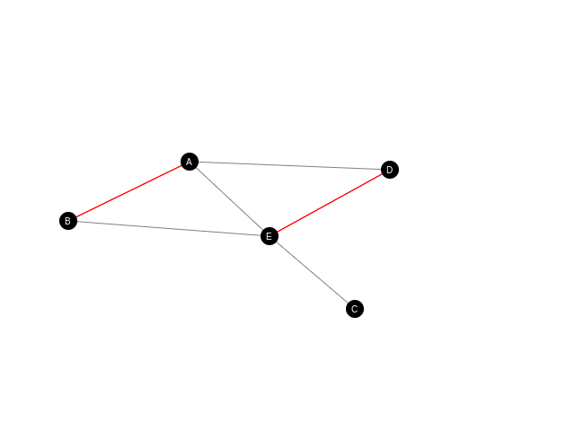

# Graph.js

Graph ES6 implementation, [See demo page](https://inwebo.github.io/Graph.js/).

## Graph

Graph representation :
 * nodes : black 
 * node key : white letters
 * bi-directional edges : red 
 * directed : grey

## Installation
```bash
git clone https://github.com/inwebo/Graph.js.git
```

## Web
* [Grids and Graphs from Red Blob Games](https://www.redblobgames.com/pathfinding/grids/graphs.html)
* [Graphs and networks](https://plus.maths.org/content/graphs-and-networks)
* [Wiki](https://en.wikipedia.org/wiki/Graph_(abstract_data_type))
